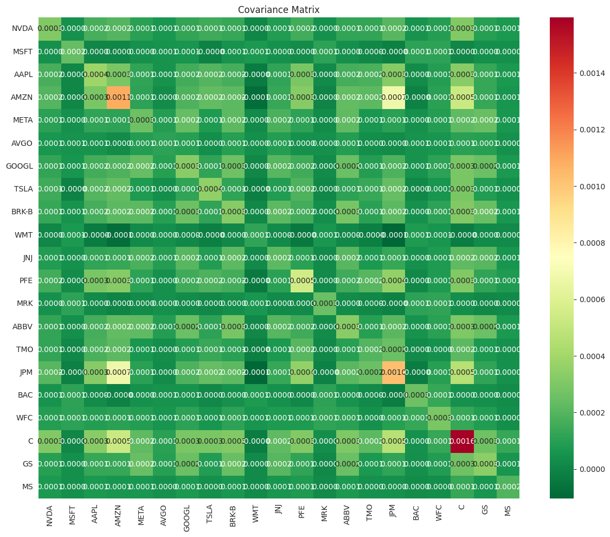
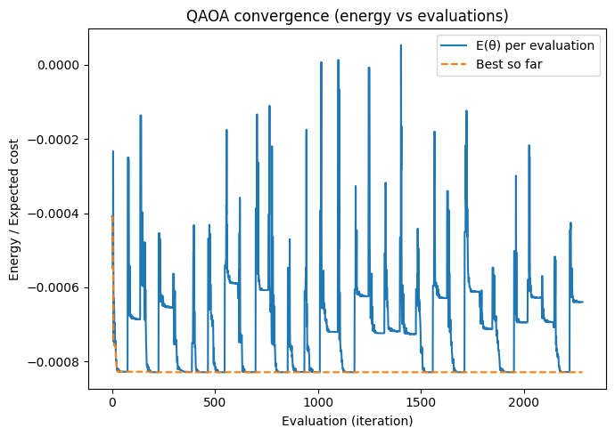
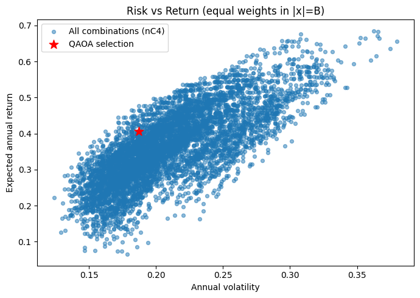
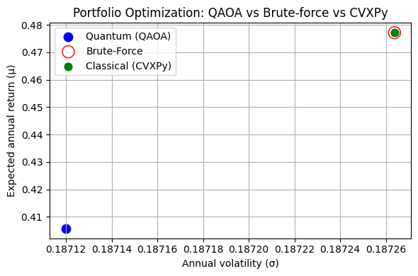

# Quantum Portfolio Optimization QAOA Project Summary

## Overview

This project focuses on solving the **portfolio optimization problem** using both classical and quantum-inspired methods. The goal is to find an optimal allocation of assets that maximizes returns while minimizing risk. The workflow progresses from data preparation to quantum optimization via QAOA, followed by a comprehensive comparison of results.

The main steps covered across the notebooks are:

1. **Data Preparation and QUBO Formulation** (`Data and QUBO.ipynb`)
2. **Brute Force Solution** (`Brute Force Method.ipynb`)
3. **Classical Optimization using CVXPY** (`CVXPy Method.ipynb`)
4. **Quantum Approximate Optimization Algorithm (QAOA)** (`QAOA GPU.ipynb`)
5. **Result Comparison and Visualization** (`Comparison.ipynb`)

---

## 1. Data and QUBO Formulation

We begin by defining the problem through historical asset data. The expected returns and covariance matrix are computed to quantify performance and risk.

### Mathematical Model

The classical portfolio optimization problem is defined as:

$$
\max_x ; (\mu^T x - \lambda x^T \Sigma x)
$$

subject to:

$$
\sum_i x_i = 1, \quad x_i \in {0, 1}
$$

where:

* (\mu) is the vector of expected returns.
* (\Sigma) is the covariance matrix.
* (\lambda) is the risk-aversion coefficient.

This objective function is then reformulated as a **Quadratic Unconstrained Binary Optimization (QUBO)** problem:

$$
H(x) = x^T Q x
$$

where (Q) encodes both the return and risk terms, suitable for quantum optimization methods.

**Key Outputs:**

* Asset statistics and correlation heatmaps.
* Constructed QUBO matrix visualizations.



---

## 2. Brute Force Method

The brute force approach evaluates all possible combinations of portfolio allocations, serving as the **ground truth** for benchmarking.

### Methodology

For $(n)$ assets, all $(2^n)$ combinations are tested to compute their objective values based on the QUBO function.

**Key Outputs:**

* Optimal portfolio configuration.
* Plot of portfolio return vs. risk.


---

## 3. CVXPY Classical Optimization

Using the **CVXPY** library, we solve the same problem via convex optimization, under continuous relaxation or binary constraints.

### Classical Formulation

CVXPY solves:

$$
\max_x ; (\mu^T x - \lambda x^T \Sigma x)
$$

subject to linear or quadratic constraints.

After solving the optimization, the main results — such as objective function value, annualized return, annualized risk, sharpe ratio, and optimal weights — are **stored in a compressed NumPy file (`.npz`)** for later use.

**Key Outputs:**

* Optimal allocation vector.
* Stored results in `.npz` format.

---

## 4. Quantum Optimization via QAOA

We apply the **Quantum Approximate Optimization Algorithm (QAOA)** using Qiskit to solve the QUBO on a simulated quantum backend (GPU-accelerated environment).

### Workflow

1. Define the cost Hamiltonian from the QUBO matrix.
2. Configure QAOA parameters (layers ($p$), optimizer, etc.).
3. Run the optimization and measure probabilities.

### Quantum Objective

The cost function for QAOA corresponds to the expectation value:

$$
C(\gamma, \beta) = \langle \psi(\gamma, \beta) | H | \psi(\gamma, \beta) \rangle
$$

where $| \psi(\gamma, \beta) \rangle$ is the parameterized quantum state.

**Key Outputs:**

* QAOA energy convergence.
* Risk vs. return energy for QAOA.



---

## 5. Comparison and Analysis

Finally, results from all methods (Brute Force, CVXPY, and QAOA) are compared in terms of accuracy, computational cost, and solution quality.

### Metrics

* Optimal portfolio composition.
* Objective function value.

**Key Visualizations:**

* Comparative bar plots of performance.
* Risk vs. return scatter plots.




---

## Conclusions

* **Brute Force** serves as the exact baseline but scales poorly.
* **CVXPY** provides efficient and accurate classical approximations and stores reusable results for analysis.
* **QAOA** demonstrates the potential of quantum optimization for combinatorial portfolio problems, achieving close-to-optimal solutions with fewer resources.

Future work includes:

* Running QAOA on real quantum hardware.
* Exploring hybrid quantum-classical optimization.
* Extending the model to multi-period or risk-constrained portfolios.

---

## Repository Structure

```bash
├── Data and QUBO.ipynb
├── Brute Force Method.ipynb
├── CVXPy Method.ipynb
├── QAOA GPU.ipynb
├── Comparison.ipynb
├── figures/
│   ├── qubo_heatmap.png
│   ├── brute_force_plot.png
│   ├── cvxpy_frontier.png
│   ├── qaoa_convergence.png
│   ├── qaoa_probabilities.png
│   ├── comparison.png
│   └── risk_vs_return_qaoa.png
└── README.md
```

---

**Project:** Quantum Portfolio Optimization (AQAOA)
**Tools:** Python, Qiskit, CVXPY, NumPy, Matplotlib
